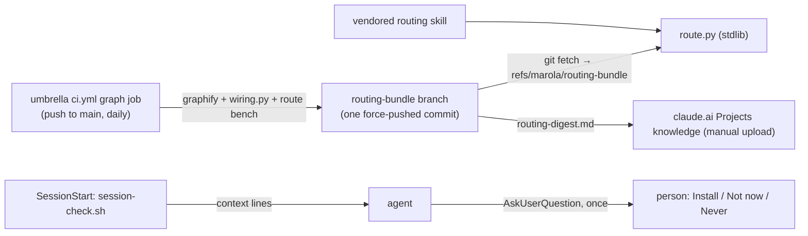

# MIP-0084: Zero-setup routing — a vendored skill, an opt-in hook and a CI-built bundle any session can query

| | |
|---|---|
| **Status** | Accepted (2026-10-10, review by Bruno Guilhermo de Barros Valério in the design session) |
| **Author** | Bruno Guilhermo de Barros Valério |
| **Created** | 2026-10-10 |
| **Phase** | None: dev-loop tooling, outside `docs/PHASES.md`'s sequence. No Phase 1 prerequisite, no paid resource |
| **Related** | MIP-0076 (the wiring block, `graph` and the `routing` skill this delivers), MIP-0080 (`skills.lock`, which vendors the skill), MIP-0079 (why the bundle is not a release), MIP-0085 (the index family that plugs into this bundle) |
| **Effort** | L — a stdlib query tool, a read-only hook, a CI job that publishes a branch, a ruleset, and a vendored skill plus a settings line in six repos |
| **Gain** | `infra/dev-loop` — every session in every repo, CLI, jail or claude.ai/code, can route a "where is it" question without the person installing or knowing anything |
| **Effort vs Gain** | `do next` — MIP-0076 shipped on 2026-10-10 and no session outside the ones that built it has called it; MIP-0085's better indexes are worth nothing until agents reach them |
| **Depends on** | MIP-0076 (implemented): `wiring.py`, `graph.sh` and the umbrella's `graph` CI job. MIP-0080's `skills-vendor` for the vendored copy. No Phase 1 gate, no paid resource |
| **Blocked by** | 0076 |
| **Risk** | The committed hook runs on every contributor's machine at every session start, with no consent step: a slow or broken hook degrades every session in six repos at once |
| **Cost so far** | — |

### Readiness

| | |
|---|---|
| **Manually reviewed** | yes — Bruno Guilhermo de Barros Valério, 2026-10-10 |
| **Written by** | Bruno Guilhermo de Barros Valério, with Claude Code (Opus 5.5) |
| **Tasks** | `MIP-0084.tasks.md` |
| **Tests** | `route_test.py` (§7), `session-check.sh --self-test`, `route bench` in the bundle job |
| **Spec-kit** | none |
| **Issues** | parent #776; marola-dev/marola-devkit#87, marola-dev/marola-devkit#88, marola-dev/marola-devkit#89, marola-dev/marola-devkit#90 (1–4), #777, #778 (5, 6), marola-dev/marola-app#94, marola-dev/marola-site#110, marola-dev/marola-corpus#15, marola-dev/marola-ml#39, marola-dev/marola-oods#33 (7–11), #779 (12) |

## 1. Summary

MIP-0076 built the routing sources, but a session reaches them only if the person installed the
devkit plugin, entered `nix develop`, initialised submodules and rebuilt the graph. This MIP removes
every one of those steps. The `routing` skill is vendored into each repo's `.claude/skills/` with a
stdlib `route` tool beside it; CI builds the graph and the wiring into a `routing-bundle` branch that
`route` reads through git; and a small read-only `SessionStart` hook asks the person, once, whether to
install the plugin's other parts.

## 2. Motivation

A scan of all 125 Claude Code sessions in the umbrella since 2026-10-03 (5,583 Bash calls) found
every `graph query` and `graph build` inside the three sessions that designed, built or benchmarked
it. No other session called it; they ran grep or rg about 2,300 times. The tool shipped hours before
the scan, so this is not yet a verdict on usefulness, but the setup alone guarantees zero use:

- **The skill is never loaded.** The umbrella's `.claude/settings.json` declares
  `marola-devkit@marola-devkit`, and the marketplace is fetched at v0.8.3, but the plugin is absent
  from `~/.claude/plugins/installed_plugins.json`. Claude Code does not fetch a plugin enabled only
  in project settings from an external source; it lists it under `/plugin`'s Errors tab as "enabled
  in project settings but isn't installed here". Nobody is asked.
- **Cloud sessions load no plugins at all** (claude.ai/code ignores `enabledPlugins` and
  `extraKnownMarketplaces`), so the skill can never reach them through the plugin.
- **`just graph` needs Nix, the `.devkit` link and every submodule.** A bare shell has none; `graph
  build` refuses an uninitialised submodule by design.
- **The local graph goes stale** silently between builds: the cached one was built at `1621466`
  while `main` had moved on.

## 3. User-visible change

Before, in a fresh clone with no plugin and no Nix:

```text
> where does the board schema come from?
● Bash(grep -rn "board.schema" .)   … 40 lines …
```

After, the first session in that clone:

```text
▸ routing: bundle main@e77c298 (2 h old) · marola-devkit plugin not installed
● AskUserQuestion: This repo offers the marola-devkit plugin. If installed it runs, on your machine,
  from marola-dev/marola-devkit@v0.8.3: a formatter after each edit, a gate when a turn ends, and a
  session-start summary; and it adds the MIP, triage and review skills. Routing works either way.
  [Install] [Not now] [Never]
```

and a "where is it" question:

```text
$ python3 .claude/skills/routing/scripts/route.py query "Swimability score"
answers from main@e77c298 (bundle)
NODE Swimability  src=marola-app/core/src/main/scala/marola/scoring/Swimability.scala
  calls → …
$ python3 .claude/skills/routing/scripts/route.py wiring marola-image
ghcr.io/marola-dev/marola-app  published by marola-app docker.yml · pinned in marola-site/marola-image … · read by marola-site/scripts/board-schema.sh
```

## 4. Data sources and dependencies reviewed

- **Claude Code's loading rules** (code.claude.com docs, fetched by a docs subagent 2026-10-10,
  Appendix): project `.claude/skills/` load with no plugin, at start for the start directory and on
  first read under a subdirectory; project hooks need no plugin and run once settings load;
  `SessionStart` output is context the model sees, and it cannot itself pose a question; plugins
  from project settings with an external source are not auto-fetched; cloud sessions load the repo's
  skills, `CLAUDE.md`, rules and hooks but no plugins, have no Nix, can run a setup script, and
  reach github.com and PyPI by default; `CLAUDE_CODE_REMOTE=true` marks a cloud session; no env var
  reports whether a plugin is installed, but `installed_plugins.json` does.
- **ai-jail** (the umbrella's `.ai-jail`): read-write maps are `~/.claude` and `~/.claude.json`
  only. `~/.cache` and `~/.config` are not persistent inside a jail, which rules out a cache or an
  opt-out marker there.
- **`skills.lock`** (MIP-0080): pins a vendored skill by upstream repo, path and commit, with per-file
  blob hashes; `skills-vendor check` gates drift and each repo's `skills.yml` opens a weekly update
  PR. The devkit can be an upstream like any other.
- **graphify** stays CI-only, at the devkit's nixpkgs pin (MIP-0076 §4). Its `graph.json`
  (`nodes`, `links`, each node with `label` and `source_file`) is the format `route` reads; the
  pruned umbrella graph is 1,598 nodes, 3,166 edges, 1.6 MB.
- **Repo visibility**: marola, marola-app and marola-devkit are public, so a submodule session
  can fetch the umbrella's bundle branch without credentials.

**Pick**: deliver through the channels that need no install (a vendored project skill, a committed
hook, `AGENTS.md`), and use the one that does (the plugin) only after the person says yes.

## 5. Design



### 5.1 The skill, vendored

`routing` moves from `plugins/marola-devkit/skills/` to a top-level `skills/routing/` in
marola-devkit, so the plugin no longer carries it and no session sees two copies. Each repo
(umbrella, app, site, corpus, ml, oods) vendors it into `.claude/skills/routing/` with a
`skills.lock` row whose upstream is `marola-dev/marola-devkit`. The directory holds `SKILL.md`,
`scripts/route.py` and `scripts/session-check.sh`, so the tool is wherever the skill is. The skill
text keeps MIP-0076 §5.3's rules and names `route` instead of `just graph`; `just route` is a thin
devkit recipe for those inside `nix develop`.

### 5.2 `route.py`

Python 3.10+ stdlib only. graphify never runs on a contributor's machine.

| Command | Does |
|---|---|
| `query "<identifiers>" [--budget 400]` | graphify's query, reimplemented: label-matched start nodes, a breadth-first walk, output cut at the budget |
| `explain <node>` / `path <a> <b>` | a node's neighbours / the shortest path |
| `wiring <term>` | matching rows of `wiring.json` |
| `fetch` | `git fetch --depth 1 <umbrella> routing-bundle:refs/marola/routing-bundle` |
| `status` | the bundle's commit, age and submodule SHAs, and whether a local graph is newer |
| `bench [file]` | runs the question file, prints right-first per question |

- **Storage is the repo's own object store.** Files are read with `git show
  refs/marola/routing-bundle:graph.json`. That is shared by every worktree (the common git dir),
  invisible to `git status`, and persistent inside a jail, which maps the checkout. In the umbrella,
  a plain clone already has `origin/routing-bundle`, and `route` reads it if the private ref is absent.
- **Which graph answers**: a MIP-0076 local graph (`~/.cache/marola-graph/<repo>`) whose `build.json`
  matches the current `HEAD` and submodules wins; otherwise the bundle. The first output line always
  says which.
- **No bundle and no network**: one line, "no routing bundle; use `git grep`", exit 0. Never a
  stack trace.
- **Data, not code**: JSON only, size-capped at 20 MB; nothing read from the bundle is executed or
  interpolated into a shell.

### 5.3 The bundle

The umbrella's `graph` job in `ci.yml` gains a publish step on `push` to `main` (pointer-sync merges
included) and a daily `schedule`. It runs `graph build`, `wiring --json`, `route bench` against the
committed `routing-bench.yaml`, and writes `graph.json`, `wiring.json`, `build.json` (umbrella HEAD,
submodule SHAs, graphify version, bench score), `manifest.json` (schema version, file sizes) and
`routing-digest.md` to an orphan commit force-pushed to `routing-bundle`.

- **Not a release asset.** The umbrella's releases feed Zenodo, and MIP-0079 makes "a pointer move
  never makes a release" a hard rule. Publishing per pointer move would mint a DOI version several
  times a day, and a Zenodo version cannot be deleted.
- **A ruleset** restricts updates to `routing-bundle` to the GitHub Actions app, so changing the
  bundle means changing a reviewed workflow on `main`. Git object hashes cover integrity.
- **The bench gates**: the job fails, and keeps the previous bundle, if the right-first score drops
  below the last published `build.json`'s. A graphify bump that silently worsens answers stops here.
- **Size**: ~2 MB compressed today; every plain clone fetches it. Past 10 MB the large files move to
  a ref outside `refs/heads/`, which clones skip.
- **`routing-digest.md`**: the wiring tables plus, per repo, each source file's top-level symbols,
  capped at 25k tokens, for a claude.ai Project's knowledge. The upload stays manual.

### 5.4 The hook

Each repo's `.claude/settings.json` gains a `SessionStart` entry running
`bash .claude/skills/routing/scripts/session-check.sh`, timeout 5 s. It reads local files only: no
network, no build, no writes. It prints at most three lines, and only on `source: startup`:

| Condition | Line for the agent |
|---|---|
| always | `▸ routing: bundle <commit> (<age>)`, or `no bundle yet; route fetch` |
| the SHA `build.json` records for this repo differs from the local `origin/main` | `… stale; route fetch refreshes it` |
| not `CLAUDE_CODE_REMOTE`, `marola-devkit@marola-devkit` absent from `installed_plugins.json`, `MAROLA_PLUGIN_OPTOUT` unset | the opt-in instruction below |
| umbrella with a submodule shown `-` by `git submodule status` | `submodule X not checked out: route answers from the bundle; git submodule update --init for local reads` |

The opt-in instruction tells the agent: if `AskUserQuestion` is available, ask before starting the
person's request, in one question, what the plugin runs on their machine and from which ref, with
three answers. **Install**: the person runs `! claude plugin install marola-devkit@marola-devkit`.
**Not now**: nothing; asked again next session. **Never**: the agent adds
`"env": {"MAROLA_PLUGIN_OPTOUT": "1"}` to the person's `~/.claude/settings.json`, after showing the
edit. Then it carries on with the request. With no way to ask (headless, a subagent), it says nothing.

`~/.claude/settings.json` is the marker's home because it is per machine (one answer covers six repos
and every worktree), reversible in `/config`, and the only one of the candidate places an ai-jail
keeps.

### 5.5 Everything else

- **`AGENTS.md`** in each repo: one line naming `python3 .claude/skills/routing/scripts/route.py`, for
  agents that load no Claude skills.
- **`docs/3-Ways-of-working/DEV-FLOW.md`**: a claude.ai/code setup script, optional, for local reads:
  `git submodule update --init --depth 1`.
- **`just route-usage`** (devkit): the transcript scan from §2, over `~/.claude/projects`, local and
  read-only. It prints, per session, `route` and wiring-block reads, prompted or not. It never
  uploads, since transcripts hold private conversations.

## 6. Scoring / safety impact

None. No code path in marola-app changes.

## 7. Verification plan

- **`route_test.py`** (devkit, on a fixture graph and a fixture bare repo):
  `query_matches_label_and_respects_budget`, `explain_lists_neighbours`, `path_found_and_absent`,
  `wiring_rows_match_term`, `reads_origin_branch_when_private_ref_absent`,
  `local_graph_wins_when_head_matches`, `no_bundle_no_network_exits_zero`,
  `oversized_file_refused`, `bench_counts_right_first`.
- **`session-check.sh --self-test`**: `plugin_installed_silent`, `plugin_missing_asks`,
  `optout_env_silent`, `remote_session_silent`, `resume_source_silent`, `stale_bundle_line`,
  `uninitialised_submodule_line`, `no_network_calls` (run under `unshare -rn` where it works),
  `under_100ms`.
- **CI**: the bundle job on a branch, with publishing to a scratch branch; a push to `routing-bundle`
  from a person's token is rejected by the ruleset.
- **Live, done means**: on fresh clones in three setups (a bare WSL shell with no Nix, `nix develop`,
  a claude.ai/code session on the umbrella and on marola-app), the skill is listed, the hook prints
  its lines, the opt-in is asked exactly once per machine where it applies, and `route` answers at
  least 7 of MIP-0076's 8 questions right first with no Nix and no graphify on the machine.
- **Adoption**, reported two weeks after rollout, not a gate: `just route-usage` across the
  maintainers' machines.

## 8. Risks, limitations, and honest caveats

- **The hook cascades.** It runs for every contributor in six repos, at every session start, with no
  consent step. A sleep, a network call or a crash in it reaches everyone on their next pull; a PR
  changing it gets code execution on every contributor's machine once merged. Hence: read-only, 5 s
  timeout, a self-test in each repo's gates, and changes to `session-check.sh` arrive only through the
  reviewed weekly `skills.yml` PR.
- **The bundle is directions agents trust.** Anyone able to rewrite it could steer agents, for
  example by placing the safety veto in `scripts/release.sh`, so an agent "fixing scoring" edits
  release tooling. The ruleset and the reviewed workflow are the defence; `route` treating it as data
  limits the damage to wrong directions, never execution.
- **Answers reflect `main`, not the branch.** The first line says so; a local `graph build` overrides.
- **The opt-in depends on the agent following an instruction.** A model that skips it costs a missed
  question, not a silent install. Nothing installs without the person running the command.
- **`route` reimplements graphify's query.** Its ranking can drift from graphify's; the bench, not
  parity, is the measure.
- **Six copies of the skill.** `skills-vendor check` and the weekly PR keep them identical; a repo
  that holds an update is visible in its lock.

## 9. Alternatives considered

- **Do nothing**: the plugin and `nix develop` stay prerequisites, and §2's count stays at zero.
- **Build locally everywhere** (a portable `graph`, rebuilt on query): always matches the working
  tree, but every machine installs a daily-changing graphify, each break hits each person separately,
  and claude.ai Projects gets nothing.
- **Commit the graph**: MIP-0076 rejected it, 5–10 MB of JSON in the tree and churn in the git
  status every session starts from.
- **The bundle as a release asset**: mints Zenodo versions (§5.3). **An Actions artifact**: expires,
  and downloading it needs a token. **docs.marola.dev**: outside the cloud sessions' default network.
- **The opt-out marker elsewhere**: the committed settings turn the plugin off for everyone who
  pulls; `.claude/settings.local.json` is per checkout, so a person is asked in every worktree;
  `~/.config` is not kept inside an ai-jail.
- **Asking later** (after the first request, or only when a plugin feature is needed) or **a notice
  instead of a question**: the first misses the hooks on the first task and gets skimmed; the second
  is nearly always, inconsistently; the third is not a decision.
- **graphify's MCP server** for cloud sessions: plugins and their MCP servers do not load there.

## 11. Open questions

- Does a project hook see `env` set in user settings? **Default:** verify live in task 2; if not, the
  marker becomes `"enabledPlugins": {"marola-devkit@marola-devkit": false}` in user settings, read by
  the hook from the file.
- Do project hooks run before the folder-trust dialog is accepted? The docs disagree with each other.
  **Decided 2026-10-10:** either answer is fine. Someone who has not trusted the folder may be asked
  later or never; the hook is read-only either way, so nothing is verified for this.
- Can a claude.ai/code session started on marola-app fetch the umbrella's branch through its git
  proxy? **Decided 2026-10-10:** nice to have, not a blocker: the umbrella is the workspace most
  sessions start in. Task 6 tries it once; if it fails, `route` says the bundle is unreachable and
  points at `git grep`.
- Which `--scope` should the install command use? **Default:** the person's user scope (the
  default), since the project scope writes the committed settings file.
- `AGENT-SKILLS.md` §2 says a declared plugin is installed for whoever accepts the trust dialog. That
  matched superpowers (official marketplace) but not marola-devkit here. **Default:** task 2 tests a
  fresh machine and corrects the page in the same PR.
- **Follow-up MIP:** MIP-0085, the routing index family (doc↔code, impact, decisions, semantic), next
  number.

## Appendix

### Checked live

- `~/.claude/projects/-home-brunogbv-brunogbv-marola/*.jsonl`, 2026-10-10: 125 sessions since
  2026-10-03; `graph query|path|explain|build` only in sessions `43ec6d89`, `eff23e3c`, `07d91bff`.
- `~/.claude/plugins/installed_plugins.json`, 2026-10-10: no `marola-devkit@marola-devkit`; the
  marketplace checkout is at `v0.8.3`; the plugin cache tops at 0.4.1.
- `.ai-jail`, 2026-10-10: `rw_maps` = `~/.claude`, `~/.claude.json`.
- `gh repo view marola-dev/{marola,marola-app,marola-devkit}`, 2026-10-10: all `PUBLIC`.
- code.claude.com, via a docs subagent, 2026-10-10: `/docs/en/plugins/loading` (project plugins from
  an external source not fetched; Errors-tab wording; cloud sessions load no plugins),
  `/docs/en/plugins/install`, `/docs/en/hooks` (`SessionStart` context, `CLAUDE_CODE_REMOTE`),
  `/docs/en/skills` (project and subdirectory skills), `/docs/en/cloud-environments` (what carries
  over, setup scripts, installed tools without Nix, default allowed domains),
  `/docs/en/permissions` (the two passages on hooks before trust that disagree).
- `~/.cache/marola-graph/marola-clean/graph.json`, 2026-10-10: 1,598 nodes, 3,166 edges, 1.6 MB.

### Not checked

- Whether hooks see user-settings `env`, the trust-dialog ordering (decided not to matter), and the
  cloud git proxy's reach (§11).
- A ruleset whose bypass list holds only the GitHub Actions app: assumed from GitHub's rulesets
  feature, not tried on this org.
- That Zenodo would mint a version for a published release made by CI: MIP-0079's rule stands
  regardless.
