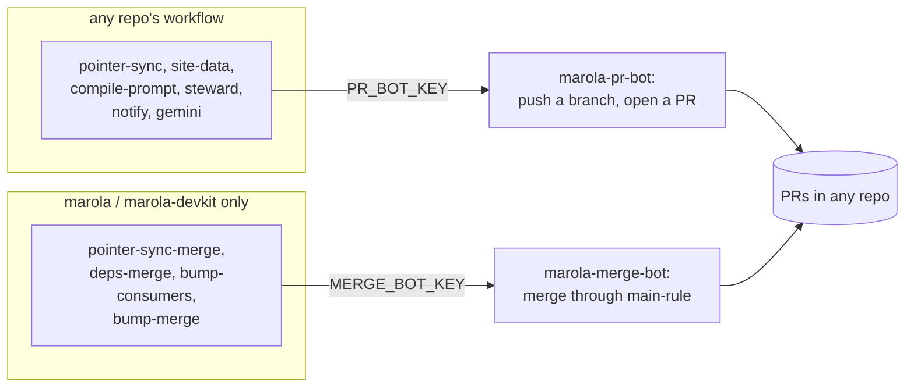

# MIP-0086: GitHub Apps for automation — `marola-pr-bot` opens, `marola-merge-bot` merges

| | |
|---|---|
| **Status** | Accepted (Bruno Valério, 2026-10-10: "its approved, open the pr and write the implementation plan") |
| **Author** | Bruno Valério, from #765, #740 and #762 |
| **Created** | 2026-10-10 |
| **Phase** | None: dev tooling outside the phase list. It provisions nothing paid; Phase 1 is untouched |
| **Related** | #765 (replace the PATs), #740 (Dependabot auto-merge), #762 (devkit bumps merge themselves), #739 (the pointer-sync App, the pattern), marola-dev/marola-devkit#74 (per-repo bypass extras) |
| **Effort** | L — a devkit composite action and a key check, a `ruleset-sync` change, six workflow migrations across six repos, two App renames; #740's and #762's merge tooling keep their own sizes |
| **Gain** | `infra/dev-loop` — every automated PR, push and commit names a bot, and nothing expires yearly; `cost/ops` — a new repo needs zero App steps, or one if it consumes the devkit |
| **Effort vs Gain** | `do next` — the PAT replacements (task rows 4–9) end "PRs opened as the maintainer" and the yearly renewal, and #740 and #762 need the merge bot anyway |
| **Depends on** | Org-owner acts in GitHub settings (rename, permissions, installations, secrets: task 1); a devkit release before the consumers move (task 2). #740 and #762 depend on this MIP for their identity; it does not depend on them |
| **Blocked by** | none |
| **Risk** | The merge bot's key is the org's widest credential: one leak lands workflow changes on every consumer's `main` and, through `secrets: inherit`, reads every repo's secrets. §5.6 confines it to two repos and to jobs that run only checked-in scripts |
| **Cost so far** | — |

### Readiness

| | |
|---|---|
| **Manually reviewed** | yes — Bruno Valério, 2026-10-10 |
| **Written by** | Bruno Valério, with Claude Code (Opus 5.5) |
| **Tasks** | [`MIP-0086.tasks.md`](./MIP-0086.tasks.md) |
| **Tests** | `bot-token`'s live self-test, `merge-key-check --self-test`, `ruleset-sync --self-test` (org-wide extra), the leak drill (§7) |
| **Spec-kit** | none |
| **Issues** | not filed yet. Rows reuse the open issues named in the tasks file; only rows 1, 3, 10, 12 and 16 are new |

## 1. Summary

Every GitHub write the org's automation makes moves to one of two org-owned GitHub Apps.
**`marola-pr-bot`** (today's `marola-gemini-bot`, renamed) proposes: it pushes branches, opens PRs,
sends dispatches and reviews, and never lands anything on `main`. **`marola-merge-bot`** (today's
`marola-pointer-sync`, renamed and widened) lands: it is the only identity that merges, and the only
one that edits workflows. The three PATs go, so automated PRs stop appearing as the maintainer's,
and App keys have no expiry date to renew. #765, #740 and #762 each picked an identity on its own
(eight Apps between them); this MIP decides identity once for all three.

## 2. Motivation

- **Automation acts as a person.** `pointer-sync.yml` pushes and opens its PR with
  `MAROLA_CROSS_REPO_PAT`, so the sync PR is opened by the PAT's owner while its commits say
  `github-actions[bot]`; neither names the automation. Bump PRs (`MAROLA_BUMP_PAT`) and Scala
  Steward's (`STEWARD_GH_TOKEN`) do the same.
- **A PAT reaches what its owner reaches.** `MAROLA_CROSS_REPO_PAT` is read by 12 workflow files in
  seven repos (#765's inventory) and can write to every repo.
- **PATs expire.** A fine-grained PAT has a maximum lifetime, so each is a yearly renewal, and the
  automation it drives fails on the day it lapses.
- **Identity was being decided three times.** #765 proposed one App per need (seven), #740 its own
  `marola-deps-merge`, #762 a `marola-bump` with Workflows write. A new repo would have needed up to
  three installations, two key grants and two bypass entries.

## 3. User-visible change

On a pointer-sync PR, before and after:

```text
before:  brunogbv opened this pull request            (commits by github-actions[bot])
after:   marola-pr-bot opened this pull request       (commits by marola-pr-bot[bot])
         marola-merge-bot merged commit 1a2b3c4 into main
```

NEW-REPO, before: step 14 (grant `MAROLA_CROSS_REPO_PAT` the repo, add it to the org secret's
access) and step 15's `MAROLA_BUMP_PAT` note. After: nothing for `marola-pr-bot`; for a devkit
consumer, one step: add the repo to `marola-merge-bot`'s installation.

## 4. Dependencies reviewed

### 4.1 Apps already installed in the org (`gh api orgs/marola-dev/installations`, 2026-10-10)

| App | Repos | Write permissions |
|---|---|---|
| `marola-gemini-bot` | all | contents, issues, pull_requests |
| `marola-pointer-sync` | selected (marola) | contents, pull_requests; checks, statuses read |
| `claude` (third party) | all | actions, checks, contents, discussions, issues, pull_requests, repository_hooks, workflows |

`marola-gemini-bot`'s key reaches every repo already: each repo's `gemini.yml` calls the devkit's
`gemini-review.yml` with `secrets: inherit`, which mints from `GEMINI_APP_PRIVATE_KEY`.

### 4.2 The org

GitHub Free; all twelve repos public (`gh repo list marola-dev`). Org-level Actions secrets and
variables therefore reach every repo (Appendix).

### 4.3 GitHub App mechanics this design relies on

App private keys have no expiry, which ends the renewal and also means a leaked key works until
revoked; installation tokens last an hour; suspending an installation blocks the App's API access
for the org; `repository_dispatch` needs Contents write; added permissions wait for the org's
approval; `actions/create-github-app-token@v3` mints fewer permissions than the App holds, covers
every installed repo when `owner` is set without `repositories`, and outputs no bot user id. Each is
in the Appendix with its source. That a rename keeps the App's ID is **not** documented; stage 0
checks it first (§5.11).

**Pick:** two Apps, both by renaming an existing one, so their installations, IDs and #739's bypass
entry carry over.

## 5. Design

### 5.1 The two Apps

| | `marola-pr-bot` | `marola-merge-bot` |
|---|---|---|
| Was | `marola-gemini-bot` | `marola-pointer-sync` (Integration 5257042) |
| Does | Gemini review and fix commits; `notify-umbrella`'s dispatch; site-data pushes and `site-data-updated`; the compiled-prompt PR; Scala Steward's PRs; opening the pointer-sync PR | every merge (pointer-sync, Dependabot pip, devkit bumps); opening devkit bump PRs, which edit workflows |
| Installed on | all repos | the devkit's consumers (`consumers.txt`) |
| Write | Contents, Pull requests, Issues | Contents, Pull requests, Workflows; Checks and Statuses read |
| Bypasses `main-rule` | never | pull request only, on every consumer |
| Key readable by | all repos: org secret `PR_BOT_KEY`, org variable `PR_BOT_APP_ID` | marola and marola-devkit only: repo secret `MERGE_BOT_KEY`, repo variable `MERGE_BOT_APP_ID` |

agent-skills' `refresh.yml` PR moves to `github.token` plus a `workflow_dispatch` of its CI
(marola-dev/agent-skills#13); it needs neither App.

### 5.2 Open versus merge



A job either proposes or lands; no job does both with one key. `pointer-sync.yml` opens the sync PR
as the PR bot in the job that runs `nix develop`; `pointer-sync-merge.yml` merges it as the merge bot
in a job that runs only `main`'s script.

### 5.3 Where a key may be readable

*Installed on* says which repos a token can act on; *readable by* says which repos' workflows can
mint one. They are independent: `MERGE_BOT_KEY` in marola mints a token for marola-ml because the
App is installed there, so #740's central job merges in any pip repo without the key leaving marola.
**A key may be readable by every repo only if its App is installed on every repo**; then a leak
from any one reaches nothing a leak from another would not. Otherwise only the repos that run its
jobs read it: `marola-pr-bot` is readable everywhere, `marola-merge-bot` by marola and
marola-devkit alone, although it is installed on neither marola-devkit nor any non-consumer.

### 5.4 Minting: the devkit's `bot-token` action

`marola-dev/marola-devkit/.github/actions/bot-token@vX.Y.Z`, a composite action over
`actions/create-github-app-token`:

- inputs `app-id` and `private-key` (a composite action cannot read secrets, so the caller passes
  the bot's), `repositories:` (required, never defaulted: with `owner:` set and no list, the token
  covers every repo the App is installed on) and `permission-*`;
- sets `git config user.name "<slug>[bot]"` and `user.email "<user-id>+<slug>[bot]@users.noreply.github.com"`,
  the user id read from `GET /users/<slug>[bot]`;
- outputs `token`, `app-slug`, `installation-id`, `user-name`, `user-email`.

Every migrated workflow uses it, so a pin, key name or identity change is one devkit release;
`release.py --consumer` moves its `@v` pin like a reusable workflow's. The two reusable workflows
(`gemini-review`, `notify-umbrella`) call `create-github-app-token` directly: a reusable workflow's
local `./.github/actions/…` would resolve in the caller's checkout.

### 5.5 A token never carries more than its job needs

deps-merge mints without `permission-workflows`, so GitHub itself refuses to merge a Dependabot PR
touching `.github/workflows/` (#740's guarantee, kept although the App now holds Workflows).
Only `bump-consumers` and `bump-merge` mint with Workflows write.

### 5.6 `MERGE_BOT_KEY` appears only in allowlisted jobs

A job that reads it checks out the repo and runs checked-in scripts only: no `nix`, no package
install, no download-and-run, no LLM, and no action beyond checkout, artifact download and the
token mint. The devkit's `merge-key-check` (`scripts/merge_key_check.py`, run by each repo's
quality gate) fails when a workflow outside `.github/merge-key-allowlist` names `MERGE_BOT_KEY`, or
when a job that names it breaks those rules. So `bump-consumers.yml` splits in two: a `prepare` job
with no key clones each consumer, moves the pins, runs `nix flake update` and `wiring`, and uploads
one patch per repo; a `publish` job with the key applies each patch, pushes and opens the PR.

### 5.7 Bypass

`bypass-extras.json` gains an `@consumers` key, applied by `ruleset-sync` to every repo in
`consumers.txt`, holding `marola-merge-bot` as a pull-request-only bypass actor; it replaces
marola's per-repo extra from marola-dev/marola-devkit#74. A new consumer needs no ruleset entry of
its own.
`marola-pr-bot` is never a bypass actor.

### 5.8 One kill switch

Org variable `AUTO_MERGE` (`true`/`false`): every merge job exits early on `false`. A `hold` label
skips one PR. It replaces #762's `BUMP_AUTO_MERGE`.

### 5.9 After a suspected leak (CI-CD.md runbook)

1. Suspend the App's installation (org settings → GitHub Apps), which blocks its API access to the
   org. Deleting the key alone leaves already-minted tokens working for up to an hour; that
   suspension also stops those is what §7's drill proves, since the docs do not say it.
2. Generate a new key, `gh secret set` it, delete the old one in the App's settings.
3. Read the audit log for the bot's pushes and merges since the suspected time; unsuspend.

There is no scheduled rotation: a key changes after a suspected leak, or when someone who could
read it leaves the org. A downloaded `.pem` is set as the secret and deleted, never stored.

### 5.10 Commits

Automation commits keep the org's trailers (`Cost: n/a (automation)`), now authored by the bot.

### 5.11 Migration: add, move, remove

| Stage | What | Undo |
|---|---|---|
| 0 | a person: rename `marola-pointer-sync` first and confirm its ID is still 5257042 (else update #739's bypass entry before anything else), then rename the other, widen the merge bot, install it on the consumers, add the new secret and variable names **beside** the old ones, list every filter on the old logins | rename back |
| 1 | one devkit release: `bot-token`, `merge-key-check`, `ruleset-sync`'s org-wide extra, `gemini-review` on `PR_BOT_*` falling back to `GEMINI_*`, `notify-umbrella` on the PR bot | pin back |
| 2 | one PR per repo replaces each PAT (tasks rows 4–9) | revert that PR |
| 3 | a person deletes the PATs and old names, after #765's grep is clean and every consumer is on stage 1's tag | — |
| 4 | #740 then #762 build their merge policies on the merge bot | `AUTO_MERGE=false` |

### 5.12 Files touched

- marola-devkit: `.github/actions/bot-token/action.yml`, `.github/workflows/bot-token-test.yml`,
  `scripts/merge_key_check.py`, `.github/merge-key-allowlist`, `scripts/release.py` (the action's
  pin), `scripts/ruleset-sync.sh` and `.github/rulesets/bypass-extras.json` (an `@consumers` key),
  `scripts/bump-consumers.sh`, `.github/workflows/{gemini-review,notify-umbrella,bump-consumers,release}.yml`
- marola: `.github/workflows/{pointer-sync,pointer-sync-merge,ci}.yml`, `scripts/pointer-sync-merge.sh`
  (the `hold` label), `.github/merge-key-allowlist`, `justfile` (`quality-other` runs `merge-key-check`),
  `docs/3-Ways-of-working/{CI-CD,NEW-REPO}.md`, `AGENTS.md` (the devkit paragraph)
- marola-app: `.github/workflows/{ci,docker-smoke,scala-steward}.yml`
- marola-ml: `.github/workflows/compile-prompt.yml`
- agent-skills: `.github/workflows/{refresh,ci}.yml`
- every `notify-umbrella` caller (marola-app, marola-site, marola-corpus, marola-ml, marola-oods):
  `.github/workflows/notify-umbrella.yml` passes `pr_bot_key` instead of the PAT

## 6. Scoring / safety impact

None.

## 7. Verification plan

- `bot-token`: a devkit workflow mints for repo A and asserts `GET /installation/repositories`
  lists only A, a push to repo B returns 403, and `git config user.email` is the bot's.
- `merge-key-check --self-test`: a fixture workflow outside the allowlist referencing
  `MERGE_BOT_KEY` fails; an allowlisted one passes.
- `ruleset-sync --self-test`: the org-wide extra is kept by `apply`; `check` reports drift when a
  consumer lacks it. `just rulesets-apply --dry-run` over the consumers shows only that addition.
- Each PAT replacement: one live run whose PR, push and commits all name `marola-pr-bot[bot]`.
- Kill switch: with `AUTO_MERGE=false`, a green pointer-sync PR stays open (run link).
- Leak drill: suspend the merge bot's installation, show a token minted before it now fails,
  unsuspend.
- Done: #765's named test, `grep -rn 'secrets\.[A-Z_]*\(PAT\|_TOKEN\)'` over every repo's
  `.github/`, lists only `GITHUB_TOKEN`, non-GitHub service tokens and `PROFILE_DISPATCH_TOKEN`.

## 8. Risks, limitations, and honest caveats

- **The merge key reaches every consumer at once.** Through Workflows write and `main-rule`'s
  bypass, a leaked `MERGE_BOT_KEY` lands a workflow on seven `main`s; since every consumer pins the
  devkit and passes `secrets: inherit` to it, that is every repo's secrets (Cloudflare, Hugging Face,
  Mapbox, Tailscale). Kept to two repos (§5.3), allowlisted jobs (§5.6), the kill switch and the
  drill. Eight Apps would have had the same exposure in `marola-bump` alone.
- **The PR key is readable everywhere.** A leak from any repo's CI (a compromised npm or sbt
  dependency, a prompt-injected review) pushes branches and opens PRs in every repo; a pushed branch
  runs its PR CI, so secrets that CI reads are exposed. It cannot merge, edit workflows or reach
  secrets only `main`'s deploy jobs read. `marola-gemini-bot` has this reach today.
- **The rename changes both bots' logins in every repo at the same moment.** A filter on
  `marola-gemini-bot[bot]` or `marola-pointer-sync[bot]` that is not updated stops matching silently;
  stage 0 lists them first.
- **Deleting a PAT early breaks every repo still using it.** A consumer on a pre-stage-1 tag fails
  `notify-umbrella` on every push to `main`; stage 3 waits for the grep and the tags.
- **`rulesets-apply` writes seven rulesets.** A wrong manifest blocks merges, or lets something skip
  review, in all of them; run the dry run first.
- **App names are global on GitHub.** The two names could be taken; the fallback is
  `marola-dev-pr-bot` / `marola-dev-merge-bot`.

## 9. Alternatives considered

- **One App per need** (#765's seven plus #740's): smallest reach per key; up to three installations
  and two bypass entries per new repo, and `marola-bump` holds the widest permission anyway.
- **Three Apps, `marola-bump` kept apart**: the Workflows key would sit in marola-devkit only; one
  more App and bypass entry per consumer. Rejected by the maintainer for upkeep.
- **One App for everything**: a key readable by every repo would merge into every repo.
- **An hourly `git ls-remote` poll instead of `notify-umbrella`**: no notify credential at all, at
  up to an hour's delay; the maintainer kept the dispatch.
- **Do nothing**: PRs keep appearing as the maintainer's and the PATs lapse within a year.

## 11. Open questions

- `PROFILE_DISPATCH_TOKEN` targets `h0ffmann/h0ffmann`, a personal account no org App can be
  installed on. **Default:** out of scope; it stays a PAT with its renewal, the maintainer's call.
- Is `GEMINI_APP_PRIVATE_KEY` an org secret or a secret in each repo today? Org secrets need an
  admin to list. **Default:** stage 0 finds out; `PR_BOT_KEY` is created as an org secret either way.
- **Follow-up MIP:** the third-party `claude` App holds Workflows and webhook write on every repo,
  more than either bot; whether to narrow its installation needs the next MIP number.
- Should `marola-pr-bot` stay on the `awesome-*` list repos? **Default:** yes, installed on all, so a
  new repo needs nothing.
- Scala Steward could propose a change under `.github/workflows/`, which the PR bot cannot push.
  **Default:** such an update fails in that run and is left to Dependabot's `github-actions`.

## Appendix

### Checked live

- `gh api orgs/marola-dev/installations`, 2026-10-10: the three Apps of §4.1 with their permissions.
- `gh repo list marola-dev`, 2026-10-10: twelve repos, all `PUBLIC`; `gh api orgs/marola-dev`: plan `free`.
- Every repo's `.github/workflows/` on `main`, 2026-10-10: secrets as in #765's inventory; every
  `gemini.yml` passes `secrets: inherit`.
- marola `pointer-sync.yml` and `ci.yml`, 2026-10-10: commits authored as `github-actions[bot]`,
  pushed with `MAROLA_CROSS_REPO_PAT`.
- marola-app `scala-steward.yml`, 2026-10-10: Steward runs with `STEWARD_GH_TOKEN || GITHUB_TOKEN`.
- <https://docs.github.com/en/apps/creating-github-apps/authenticating-with-a-github-app/managing-private-keys-for-github-apps>,
  2026-10-10: "Private keys do not expire and instead need to be manually revoked"; generated in the
  App's settings only (the REST Apps reference has no endpoint for it).
- <https://docs.github.com/en/apps/creating-github-apps/authenticating-with-a-github-app/generating-an-installation-access-token-for-a-github-app>,
  2026-10-10: "The installation access token will expire after 1 hour."
- <https://docs.github.com/en/apps/maintaining-github-apps/suspending-a-github-app-installation>,
  2026-10-10: suspension blocks the App's access to the GitHub API for that account; silent on
  tokens minted before it.
- <https://docs.github.com/en/rest/authentication/permissions-required-for-github-apps>,
  2026-10-10: `POST /repos/{owner}/{repo}/dispatches` is under Contents, write.
- <https://docs.github.com/en/actions/how-tos/write-workflows/choose-what-workflows-do/use-secrets>
  and <https://docs.github.com/en/rest/actions/secrets>, 2026-10-10: org secrets and variables are
  not accessible by private repos on GitHub Free; visibility is `all`, `private` or `selected`.
- <https://docs.github.com/en/apps/maintaining-github-apps/modifying-a-github-app-registration>,
  2026-10-10: the name can be changed; added permissions need each installation's approval, removed
  ones apply at once; nothing on whether the ID survives a rename.
- <https://github.com/actions/create-github-app-token>, 2026-10-10: inputs `owner`, `repositories`,
  `permission-<name>`; with `owner` and no `repositories`, all repos of the installation; outputs
  `token`, `installation-id`, `app-slug`; commit email `<user-id>+<slug>[bot]@users.noreply.github.com`
  with the id from `gh api /users/<slug>[bot]`. Latest release v3.2.0.
- <https://docs.github.com/en/rest/repos/rules>, 2026-10-10: `actor_type` `Integration`,
  `bypass_mode` `always` / `pull_request` / `exempt`.

### Not checked

- That renaming an App keeps its ID and changes its bot login (stage 0 checks the first).
- That suspending an installation also fails tokens minted before it (§7's drill).
- That a same-repo `pull_request` run receives Actions secrets: the events page states only that
  fork runs do not.
- The PATs' actual expiry dates (their settings are the owner's).
- Whether any script or ruleset filters on the current bot logins (stage 0's search).
- Whether the names `marola-pr-bot` and `marola-merge-bot` are free: private Apps 404 on
  `GET /apps/<slug>` whether taken or not.
