# MIP index

Design docs for non-trivial changes, written before they're built. The process and template live
in the `/marola-devkit:mip` skill; this file is the index. Statuses: Draft →
Accepted → Implemented (or Rejected / Superseded). A MIP built in stages before every task lands
carries `Partially implemented (tasks a–b of N — #PR #PR)`, naming exactly which tasks are done and
what's still missing in its own status row — never a bare "Implemented" until the whole task list
(`MIP-NNNN.tasks.md`, when it exists) is merged.

**Reading the table.** `Effort` and `Gain` are the one-line summary of each MIP's own metadata block
(right after its title table) — read that block for the full reasoning, the `Depends on`/`Risk`
detail, and the exact `Cost so far` sourcing. `Verdict` is the `Effort vs Gain` call from that same
block: `do next` (build it now), `do when X lands` (blocked on a named prerequisite), `cheap win`
(small effort, ships on its own), `expensive, defer` (real value, not worth the cost yet), or `park`
(needs a precondition — usually accumulated data or a later phase — that doesn't exist yet). `Cost
so far` is the summed `Cost:` trailers of a MIP's merged PRs (implementation and, where traceable,
the MIP's own drafting commit); "—" means nothing has merged for it yet, "n/a" means something
merged but carries no usable `Cost:` figure (predates the trailer convention, or the trailer was left
as an unfilled placeholder).

| MIP | Title | Status | Created | Effort | Gain | Verdict | Cost so far |
|---|---|---|---|---|---|---|---|
| [MIP-0001](./MIP-0001-water-quality-and-sea-lore.md) | Bathing-water quality in the ranking, and a sea-lore paragraph in every reply | Implemented | 2026-09-05 | M | user value | cheap win (delivered) | n/a |
| [MIP-0002](./MIP-0002-telegram-bot-phase-1.md) | The Telegram bot — marola's first real user surface | Draft | 2026-09-05 | L | user value | do next | — |
| [MIP-0003](./MIP-0003-fast-replies-caching-and-fan-out.md) | Replies in under three seconds — caching, concurrent fetches, precomputed boards | Draft | 2026-09-05 | M | infra/dev-loop; cost/ops | do next | — |
| [MIP-0004](./MIP-0004-daily-digest-subscriptions-and-reach.md) | The reason to come back — daily digest, subscriptions, and reach beyond Santa Catarina | Draft | 2026-09-05 | L | user value | do when X lands | — |
| [MIP-0005](./MIP-0005-map-and-static-site.md) | The map — every beach's daily recommendation on a static site the pipeline feeds | Implemented | 2026-09-05 | L | user value; cost/ops | cheap win (delivered) | ~$12.46 |
| [MIP-0006](./MIP-0006-live-look-user-cameras.md) | "How does it look right now?" — a live look at each beach, fed by users' cameras | Draft | 2026-09-05 | XL | user value | do when X lands | ~$0.7 (shared w/ MIP-0007) |
| [MIP-0007](./MIP-0007-time-series-foundation-models.md) | Time-series foundation models for marola's own series — local open models first | Draft | 2026-09-05 | L | infra/dev-loop | park | ~$0.7 (shared w/ MIP-0006) |
| [MIP-0008](./MIP-0008-docker-images-and-smoke-test.md) | Docker images — lightweight JVM, native (GraalVM), marola-ollama, a fine-tuned variant — built in CI, with a smoke test the map shows | Implemented | 2026-09-05 | XL | infra/dev-loop; cost/ops | cheap win (delivered) | ~$15.98 |
| [MIP-0009](./MIP-0009-map-wave-markers-and-hover-aspects.md) | A richer map — a wave marker per beach and, on hover, every aspect at that point (wind with an emoji, whales, jellyfish, water temperature) | Implemented (tasks: `MIP-0009.tasks.md`, 4 PRs #144-#147) | 2026-09-05 | S | user value | cheap win (delivered) | ~$3.18 (shared bucket) |
| [MIP-0010](./MIP-0010-mlflow-experiment-tracking.md) | MLflow as marola's experiment ledger — benchmark runs, prompt compiles and LLM traces, local server first | Implemented (v1, local only) | 2026-09-05 | L | infra/dev-loop | cheap win (delivered) | ~$16.52 |
| [MIP-0011](./MIP-0011-claude-code-best-practices.md) | Claude Code best practices in this repository — hooks as gates, a shared permission allowlist, path-scoped rules, subagents and skills | Implemented, ultrareview-verified 2026-09-06 | 2026-09-05 | M | infra/dev-loop; cost/ops | cheap win (delivered) | ~$12.86 |
| [MIP-0012](./MIP-0012-llm4s-adoption-and-dspy-deprecation.md) | llm4s as marola's Scala-native LLM/agent layer (opt-in module behind marola's traits) — and the deprecation of the Python DSPy step for a Scala prompt compiler | Draft | 2026-09-05 | XL | infra/dev-loop | do when X lands | n/a |
| [MIP-0013](./MIP-0013-opencode-tryout.md) | OpenCode as marola's development agent — a bounded tryout, and what replacing Claude Code would take | Partially implemented (tasks 1-2 of 6 — PR #197, `MIP-0013.tasks.md`) | 2026-09-05 | S | infra/dev-loop | cheap win | ~289k tok (unpriced) |
| [MIP-0014](./MIP-0014-marola-book.md) | A marola book — *The Compiler Pushes Back*, written in LaTeX, versioned in a repo, built in CI | Draft | 2026-09-05 | XL | community/outreach | expensive, defer | — |
| [MIP-0015](./MIP-0015-interacao-swim-matching.md) | Interação — opt-in "who else is swimming here" matching between marola users | Draft | 2026-09-05 | L | user value | park | — |
| [MIP-0016](./MIP-0016-water-quality-map-markers.md) | Water-quality points on the map — OK / not-OK marks, placed in the sea off the OSM coastline, not on the land where the agency and OSM centres put them | Draft | 2026-09-06 | M | user value | do next | — |
| [MIP-0017](./MIP-0017-agentic-tooling-survey.md) | Agentic tooling ideas from `ai-job-search` and September 2026's trending agent repos | Draft | 2026-09-06 | S | infra/dev-loop | cheap win (§5.1/§5.2); §5.3 no urgency | — |
| [MIP-0018](./MIP-0018-self-documentation-and-media-exporter.md) | Marola self-documentation — weekly post-planner and multi-platform exporter (LinkedIn, blog repo, Substack, Reddit) | Draft | 2026-09-06 | M | infra/dev-loop | cheap win | — |
| [MIP-0019](./MIP-0019-arxiv-ocean-forecasting-survey.md) | arXiv/trending-repo survey — sea-forecasting and jellyfish-prediction techniques for marola | Draft | 2026-09-06 | S/M/L (per §5 item) | user value | cheap win (§5.1); do when X lands (§5.2); park (§5.3) | — |
| [MIP-0020](./MIP-0020-instagram-bot-account.md) | An Instagram account for marola — first post by hand, then API publishing (Instagram Login: professional account, JPEG at a public URL, no Facebook Page, no App Review for an owned account), then a daily pipeline rendered from the board and gated by a GitHub Environment approval (absorbed the former MIP-0024 draft) | Draft | 2026-09-06 | M | community/outreach; infra/dev-loop | cheap win (v1: post by hand) / do when MIP-0018 lands (API path) | — |
| [MIP-0021](./MIP-0021-beach-accessibility.md) | Beach accessibility — parking, toilets, showers and lifeguard posts from OSM, shown only where the data exists ("no data", never "none") | Implemented — merged via PR #202 | 2026-09-06 | S | user value | cheap win (delivered) | — |
| [MIP-0022](./MIP-0022-safety-answer-footer.md) | The safety footer — every answer grounded in a `knowledge/safety/` document ends with lifeguard/193/SAMU 192, appended after the model, never by it | Implemented — merged via PR #195 | 2026-09-06 | S | user value | cheap win (delivered) | ~$73.38 |
| [MIP-0023](./MIP-0023-waitlist-promotion-and-maintenance.md) | Product expansion — a wait-list, honest promotion, and the easiest way to keep marola's site and backend maintained | Draft | 2026-09-06 | S/M/L (per §5 item) | user value; infra/dev-loop; cost/ops | cheap win (§5.1/§5.3); do when X lands (§5.2) | — |
| [MIP-0024](./MIP-0020-instagram-bot-account.md) | The daily Instagram pipeline — automated, per-day content on top of MIP-0020's account | Superseded by [MIP-0020](./MIP-0020-instagram-bot-account.md), which absorbed the draft; the file was never written | 2026-09-06 | S (on top of MIP-0020) | user value; cost/ops | do when X lands | — |
| [MIP-0025](./MIP-0025-marola-sea-domain-model.md) | marola-sea-1.0 — a small domain-tuned model (QLoRA SFT + tool-call SFT + DPO) served through Ollama | Partially implemented (tasks 1-5 of 6 — PRs #192, #211, #210, #209, #228, #206) | 2026-09-06 | M | user value | do next (task 1); do when X lands (tasks 2-6) | — |
| [MIP-0029](./MIP-0029-ocean-layer-positioning.md) | Positioning — marola as the ocean intelligence layer; "best hour to swim" as its first use case | Implemented — merged via PR #179 | 2026-09-06 | S | user value; community/outreach | cheap win (delivered) | — |
| [MIP-0030](./MIP-0030-coastal-trails.md) | Trails on the map: named OSM paths and `route=hiking` relations within 500m of a beach or lake. A weekly per-state ETL loads Geofabrik's regional extracts (ODbL), filtered with `osmium`, into MIP-0075's B2 DuckLake (`trail_route` by `uf`, `lake`, a licence-carrying `trail_source`), and `exports/trails/<key>.json` replaces the build's Overpass query, which stays as the fallback. Code in marola-app's `oods` module, workflow in marola-oods. Wikiloc and AllTrails were rejected for lack of reuse terms. [Tasks](./MIP-0030.tasks.md) | Partially implemented (board `trails` and the site layer shipped; tasks 1–13 remain — #678) | 2026-09-06 | M | user value; infra/dev-loop; cost/ops | cheap win (tasks 1–3); do when MIP-0075 lands (the lake) | n/a |
| [MIP-0031](./MIP-0031-water-quality-inea-inema.md) | Water quality for Rio (INEA) and Bahia (INEMA) — PDF bulletin parsing plus a curated point-coordinate table, since neither institute publishes a JSON feed or coordinates | Partially implemented (tasks 1-4 of 6 — PRs #200, #203, `MIP-0031.tasks.md`) | 2026-09-06 | M | user value | do next (tasks 5-6: client wiring) | — |
| [MIP-0032](./MIP-0032-model-strategy-benchmark-matrix.md) | The model × strategy benchmark matrix — closed API vs. open local vs. marola-RAG vs. marola-tuned on the same questions, with latency and cost columns; local rows free and gated, paid rows opt-in per run | Draft | 2026-09-06 | M | infra/dev-loop; cost/ops | do next (free half) / do when X lands (paid arm: human go-ahead + key) | — |
| [MIP-0033](./MIP-0033-release-0.md) | Release 0 — the repo goes public, a self-hosted chatbot (Ollama + Cloudflare Tunnel, graceful offline state), the first Hugging Face-published model, and a new Milestones/Releases doc linking MIPs to a named release | Partially implemented (§5.2 of 6 — PR #196, #229) | 2026-09-06 | L | user value; community/outreach; infra/dev-loop | do next (§5.1, §5.3, §5.4) | — |
| [MIP-0034](./MIP-0034-rss-feeds-and-content-syndication.md) | RSS in and RSS out — INMET's live warning feed as an expiring alert banner, a reading queue that feeds `corpus-doc` instead of the index, and marola's own Atom feed on the site | Draft | 2026-09-07 | S/M/L (per §5 item) | user value; infra/dev-loop | cheap win (§5.6 outbound, §5.3 reading queue); do next (§5.2 INMET alerts); park (§5.5 transcripts, §5.7b); reject (auto-ingest into `knowledge/`) | — |
| [MIP-0035](./MIP-0035-map-plugin-api.md) | A plugin API for marola's map — a `windy-plugin-template`-style third-party JS layer, loaded client-side via a committed `plugins.json` manifest; confirmed it needs no move off GitHub Pages. Scoped as a Release 1 item, after MIP-0033's Release 0 | Accepted — implemented, pending merge on `mip-0035/1-plugin-api` | 2026-09-07 | M | user value; community/outreach; infra/dev-loop | do next (after Release 0) | — |
| [MIP-0036](./MIP-0036-marola-advertising-action.md) | Marola Advertising Action (MAA) — the Release 0 launch, channel by channel (LinkedIn personal + org Page, Reddit, YouTube, Instagram via MIP-0020, Medium, Substack), staggered over eight days, and how to sustain it after (handed to MIP-0018) | Draft | 2026-09-07 | M | community/outreach; infra/dev-loop | do when MIP-0033 lands | — |
| [MIP-0037](./MIP-0037-map-pwa.md) | A PWA for marola's map — a service worker caches the app shell and the last board so a flaky-signal beach visit stays usable, offline shown honestly, not hidden (ROADMAP.md §7 K8) | Draft | 2026-09-07 | S | user value; infra/dev-loop | cheap win | — |
| [MIP-0038](./MIP-0038-forecast-model-spread.md) | Model spread — when the wave models disagree, marola says so instead of picking one: `models=` on the marine call it already makes, a deterministic agreed/mixed/split word, the score untouched | Draft | 2026-09-07 | M | user value | do next | — |
| [MIP-0039](./MIP-0039-deterministic-fact-guard.md) | The fact guard — a deterministic check that the model's sentence only says what the numbers say, applied after the model like MIP-0022's footer, never by it | Draft | 2026-09-07 | M | user value | do next | — |
| [MIP-0040](./MIP-0040-validating-the-reviewer-judge.md) | The reviewer has never been validated — pin its decoding, measure it with Cohen's kappa against human labels, then make it a jury of small local models from disjoint families | Draft | 2026-09-07 | M | infra/dev-loop | do next (§5.1 fix + measurement) / do when X lands (the jury) | — |
| [MIP-0041](./MIP-0041-soft-book-ingestion.md) | Soft book ingestion — a maintainer dev-tool distilling short, page-cited candidate principles from a book (first run: Weinberg's *The Psychology of Computer Programming*), classified knowledge vs. agentic-behavior, never auto-applied to AGENTS.md/rule files | Draft | 2026-09-07 | M | infra/dev-loop | cheap win | — |
| [MIP-0042](./MIP-0042-map-v2-live-not-static.md) | `marola.dev/v2` — a map that computes live in the visitor's browser (Open-Meteo is CORS-open; Overpass and the water-quality bulletins are not, so beaches and water stay precomputed), with today's static map frozen at `/v1/` and kept as v2's fallback | Draft | 2026-09-07 | L — a Scala.js cross-build of the scorer (this repo's first JS build target), a second client tree, and a `site.yml` that publishes both; re-rated from M once §4.4 established the scorer cannot be hand-ported to JavaScript without duplicating safety-relevant logic | user value; infra/dev-loop; cost/ops | do next (§5.1's v1 freeze) / do when the Scala.js cross-build proves out (§5.3–§5.4) | — |
| [MIP-0043](./MIP-0043-awesome-agentic-engineering-list.md) | `docs/4-Research-and-plans/AWESOME-AGENTIC-ENGINEERING.md` — a curated awesome-list of agentic-engineering tooling plus a human-gated candidate digest script, and a verified "top 10 repos similar to marola" section | Implemented — merged via PR #222 | 2026-09-07 | S | community/outreach; infra/dev-loop | cheap win (delivered) | — |
| [MIP-0044](./MIP-0044-site-sections.md) | marola.dev becomes a site, not just a map — news, a markdown dev blog, generated Scala/Python API docs, a feeds page, about/contact, and a restrained support page | Partially implemented (§5.6 — #300, #306, rebuilt by MIP-0064); accepted 2026-09-28 for tasks 1–2 of [`MIP-0044.tasks.md`](./MIP-0044.tasks.md) (the §5.7 menu, the §5.1 generator) | 2026-09-07 | XL — a page generator, a nav, a markdown pipeline, two documentation toolchains and a new CI workflow, editing five load-bearing pieces of the existing site machinery at once | user value; community/outreach; infra/dev-loop | do next (§5.7 menu, §5.1–§5.3); do when MIP-0034 lands (§5.4 feeds page); §5.5 and §5.6 done by #300/#306 and MIP-0064 | — |
| [MIP-0045](./MIP-0045-nlp-and-parsing-over-llm.md) | Classic NLP and parsing where an LLM call is currently paying for it — a survey of marola's product pipeline and its own dev loop | Draft | 2026-09-07 | M — one new `KnowledgeStore` in `core` (no new dependency), one benchmark arm, one script change; re-rated from S after §4's probe | cost/ops; infra/dev-loop | cheap win (§5.1, §5.2); do next (§5.4); park (§5.3) | — |
| [MIP-0046](./MIP-0046-remove-ai-slop-ui.md) | The map without the generated look — a chart-derived icon set replacing every emoji on the page | Accepted 2026-09-28 — two tasks in [`MIP-0046.tasks.md`](./MIP-0046.tasks.md); the §5.6 chip option is decided in the acceptance PR | 2026-09-07 | M — three site files plus `scripts/site_check.js`, whose emoji assertions are a `just quality-other` gate and have to move in lockstep; "done" needs a browser at 390/1280 px, not only the stub harness | user value; infra/dev-loop | do next — self-contained, and it wants to land before MIP-0042 freezes today's client at `/v1/` | — |
| [MIP-0047](./MIP-0047-desmos-equation-art.md) | Equation-drawn art — Desmos as the sketchpad, the equation as the source, static SVG as the only thing shipped (five sea motifs; no third-party script, no Desmos-exported file, no build step) | Draft | 2026-09-07 | S — one stdlib Python generator with a `--self-test`, one equations file, a generated `<symbol>` block in MIP-0046's sprite; the authoring is hours of human eye-work but not build effort | user value; infra/dev-loop | do when MIP-0046 lands | — |
| [MIP-0048](./MIP-0048-scaling-marola-sea.md) | Scaling marola-sea — which model, which checkpoint, which hardware, and the data ceiling | Draft | 2026-09-07 | M | user value; infra/dev-loop | do next (4B/7B); park 27B | — |
| [MIP-0049](./MIP-0049-scala-for-the-web-layer.md) | Scala for the web layer — Tyrian, Laminar, ScalaTags, or better plain-JS discipline | Draft | 2026-09-08 | Per option: S for server-side HTML, L for a Scala.js view layer (a JS build target, a bundle, and a replacement for `site_check.js`), XL for both | infra/dev-loop; user value only indirectly | cheap win (server-side HTML); do when MIP-0042's cross-build proves out (the client layer); reject a game engine | — |
| [MIP-0050](./MIP-0050-brazilian-llms.md) | Manacá-1B and the Brazilian-Portuguese models — a base to fine-tune, not a model to drop in | Draft | 2026-09-09 | M for the evaluation arm (a preset row, a GGUF pull, a benchmark arm); L for fine-tuning on a Manacá base (a unigram-tokenizer conversion path, and a corpus that is currently English) | user value (the audience is Brazilian, the output is English); infra/dev-loop (a PT-native 1.7B base beats SmolLM2-360M) | do next (the evaluation arm — MIP-0048 needs the number anyway); do when the corpus is Portuguese (the fine-tune); reject Sabiá-7B on licensing | — |
| [MIP-0051](./MIP-0051-wave-model-ensemble.md) | Which wave model is marola quoting? — a labelled multi-model ensemble, and the road to our own grid | Draft | 2026-09-10 | M for the ensemble (one query parameter, one `enum`, a median — no new call, no new dependency) and M for the buoy ledger; L for running our own nearshore grid (designed, not built) | user value (marola quotes one model as fact; at Jurerê that number ranges 0.20–1.34 m depending which you ask); infra/dev-loop (a buoy-scored ledger makes forecast quality a weekly number instead of an opinion) | do next (the ensemble and the ledger — the disagreement is measured and crosses live scoring thresholds); do when the ledger has a season (our own grid) | — |
| [MIP-0052](./MIP-0052-wave-model-compute.md) | Should marola ever run its own wave model, and in what language? — a costed survey | Draft | 2026-09-10 | S for this MIP (it is a survey whose deliverable is a decision); the thing it surveys is XL and out of marola's tree — the attached plan estimates 7–12 months solo with ~40% stall risk | infra/dev-loop (a costed answer, with a named trigger, to a question that will otherwise keep resurfacing) | park — marola's target 1.1 km nest is ~87 core-hours per cycle and needs no port; revisit only if 550 m proves necessary, and only after MIP-0051's buoy ledger says nearshore resolution is the binding error | — |
| [MIP-0053](./MIP-0053-learned-local-correction.md) | A learned local correction, not another model — statistical downscaling of the public wave forecasts | Draft | 2026-09-10 | M — an offline Python trainer, a JSON artefact of coefficients, and a deterministic Scala applier; the `dspy/` pattern, no runtime Python, no GPU, no new dependency | user value (a 6.7× model disagreement at Jurerê fixed in days rather than months); infra/dev-loop (MIP-0051's buoy ledger becomes a training set, so the same data earns twice) | do next for the offshore correction; park the sheltered-bay correction that motivated it — there is no local observation to train on, and no model form fixes a missing dataset | — |
| [MIP-0054](./MIP-0054-portuguese-first-experience.md) | Portuguese first — marola's whole user-facing experience in pt-BR, with a language choice that sticks and a location-aware default. **Release blocker: Release 0 (MIP-0033) does not ship until this lands** | Accepted 2026-09-28 for tasks 1–3 of [`MIP-0054.tasks.md`](./MIP-0054.tasks.md) (the site's half, then note codes) — release blocker | 2026-09-12 | XL — a message catalog in two runtimes (Scala for CLI/MCP/board, JS for the site), a board-contract change (codes, not English prose), a pt-BR corpus with per-file sources, a pt-BR DSPy recompile of both prompts, a deterministic language guard, a rewrite of `scripts/site_check.js`'s copy assertions, and a language/location precedence in the client; no new dependency | user value (the audience is Brazilian, every surface but the safety footer answers in English); infra/dev-loop (one catalog file per language instead of strings scattered over four places) | do next — a declared release blocker, and §4.3 shows the default model can do it; nothing in it waits on another MIP | — |
| [MIP-0055](./MIP-0055-vector-store-and-ocean-knowledge-chunking.md) | A vector store behind `KnowledgeStore`, and a chunker that knows what kind of ocean knowledge it is cutting — Lucene HNSW + BM25 as the local store, typed chunks with provenance, a golden-set recall@k | Draft | 2026-09-13 | L — one new dependency (Lucene) and one new `KnowledgeStore` in `local/`, a typed chunk record and kind-aware chunker in `core/`, an offline ingest pass, a golden set; no new module, no CI workflow | user value (right passage cited, in either language, for a corpus about to grow); infra/dev-loop (recall@k makes chunking/embedder changes a number) | do next (what MIP-0054's pt-BR corpus and MIP-0032's RAG arm need) | — |
| [MIP-0056](./MIP-0056-oods-open-ocean-data-store.md) | OODS — an Open Ocean Data Store for Brazilian bathing-water quality: git-versioned raw + Parquet under `data/oods/`, one adapter per institute, a DuckDB common view, a daily idempotent ingest workflow; IMA/SC first, from the portal's 2003→today per-beach CSV export | Draft (tasks: `MIP-0056.tasks.md`) | 2026-09-14 | L — a new `oods/` sbt module, one dependency (DuckDB JDBC) in it alone, a committing CI workflow, a `.gitignore` carve-out and a one-off ~40 MB data PR | user value (23 years of per-point history where today there are five samples); infra/dev-loop (the store is the map's fallback when the portal is down); cost/ops (a public dataset queryable without marola) | do next — the source is verified live, richer than what the app uses, free; the app payoff is one env var | — |
| [MIP-0057](./MIP-0057-gcp-as-opt-in-cloud-backend.md) | GCP as an opt-in cloud backend — a service-by-service review (Vertex AI/Gemini, Google Maps Platform, Firestore, Cloud Vision, Cloud Logging/Trace) for each pluggable integration; recommends a single low-risk `gcp/` LLM-only slice if any, commits to no build | Draft | 2026-09-15 | S for the MIP itself; M for the recommended slice if built | infra/dev-loop; cost/ops | do when X lands — no urgency, a comparison for whenever a second LLM vendor is wanted | — |
| [MIP-0058](./MIP-0058-daniela-vicentini-artwork.md) | A credited human artist — Daniela Vicentini's paintings on marola.dev, verified Instagram/atelier links and an "arte terapia" thanks credit on `about.html`; embedding actual paintings is designed but not built, pending real files from the artist | Draft | 2026-09-15 | S for the credit; S/M for artwork embedding once files exist (not built) | user value | do next for the credit; park for artwork embedding until files are delivered | — |
| [MIP-0059](./MIP-0059-jev-typed-decisions.md) | Jev (TypeSafe AI) as an opt-in typed-decision backend — a `DecisionClient` trait (Choice / Score / Noul) with the local Ollama/deterministic path as default and Jev opt-in behind `MAROLA_DECISION_PROVIDER=jev`; bootstraps on the benchmark judge and RAG reranking, never on swim-safety scoring. No free tier: early-access waitlist, $0.042/MTok in, output free | Draft | 2026-09-19 | M — one trait, two impls, an `AppConfig` factory, direct HTTP (no Scala SDK exists) | infra/dev-loop; cost/ops | cheap win for the two offline uses; do when Phase 1 lands for anything user-facing | — |
| [MIP-0060](./MIP-0060-open-code-review-on-ready.md) | Open Code Review on request, on marola's own runners — alibaba/open-code-review (Apache-2.0 Go CLI) run only when asked (`just ocr-review` / `workflow_dispatch`), Nix-pinned via `nix-config` `labs/agentic`, run inside ai-jail without the GitHub token against local Ollama by default, one advisory `COMMENT` review posted by a separate step; never a required check; hosted LLM is opt-in and gated. Adds a fourth on-request route to `DEV-FLOW.md` §5 | Partially implemented (task 1 of 3 — #391) | 2026-09-19 | L by the rubric (a CI workflow), small in lines; plus one upstream `nix-config` PR (`ocr` package, `jail-run ocr`) | infra/dev-loop; cost/ops | park after task 1 (7B local model unusable); cheap win once a model passes §7.1 incl. a Scala PR | — |
| [MIP-0062](./MIP-0062-ressaca-hazard.md) | Ressaca — a deterministic storm-surge hazard in `Swimability`: a veto at the wave height at which the Navy issues a ressaca warning (2.5 m, reported, not yet read at source), a labelled heuristic *watch* note when a spring tide and a strong southerly wind line up below that, and a curated per-beach erosion-record note from the published S2ID analysis (Dutra et al., UFSC, 13 Florianópolis beaches, 2010–2022). Prompted by a video essay whose own figures are unsourced and therefore not used. No new dependency or network call; no model involved | Draft | 2026-09-19 | M — one function family in `scoring/`, a moon-phase helper, a data file, a knowledge page | user value | do next | — |
| [MIP-0063](./MIP-0063-github-issue-tracking-standard.md) | A GitHub-native tracking standard — issues as the unit of work (stories and tasks, with native sub-issues), milestones as deliverables rather than a sequence, one org project board, native issue dependencies at every level — between issues and between sub-issues of the same parent — derived from the `depends on` column rather than drawn by hand, and a five-rule Definition of Ready (`agent-ready`) that gates what an agent may pick up. Adds `scripts/issues.sh` + a `.github/labels.yml` manifest, four issue forms whose field labels render as the `###` headings the readiness check greps for — per tier, not one shared set, a `triage` skill and a `tasks-to-issues` step on `mip-tasks`. Borrows three decisions from GitHub spec-kit via `brunogbv/cv` without adopting spec-kit | Partially implemented (tasks 1–7 of 8 — #423 #429 #430 #435 #436 #443 #450) — `Tasks: MIP-0063.tasks.md` | 2026-09-27 | M — one script family, four issue forms, a labels manifest, one new skill and one extended; no Scala, no new module, no CI workflow (§11.1 defers those) | infra/dev-loop | do next — every later harness layer (validation gates, graphify, autonomous triage) needs a machine-readable work queue, and there isn't one | — |
| [MIP-0064](./MIP-0064-mkdocs-documentation-site.md) | mkdocs-material + self-hosted Kroki as the documentation site at marola.dev/docs, ported from an existing production setup: `mkdocs/` (Dockerfile + compose) and `scripts/mkdocs.sh`, the 18 guides and all 59 MIPs rendered and full-text searchable, nav built from the file tree (no `nav:` key), Mermaid rendered server-side to SVG so the site keeps `script-src 'self'`, and the scaladoc/pdoc trees folded into the same `/docs` output. Replaces `scripts/build_docs_index.py`'s link-to-GitHub index; extends `api-docs.yml`, leaves `site.yml` untouched | Implemented — #459 → #463 → #465 → #473 → #475 (`Tasks: MIP-0064.tasks.md`) | 2026-09-28 | L — a container-based build and a rewired CI workflow; no Scala | infra/dev-loop; user value | do next — the Docs tab is already shipped and already disappointing | ~$76.42 |
| [MIP-0065](./MIP-0065-ci-cd-on-github-hosted-runners.md) | CI/CD on GitHub-hosted runners: the nine jobs routed to the maintainer's desktop through `vars.CI_RUNNER || 'self-hosted'` (#340, a private-repo minutes fix) move to `ubuntu-latest` now that the repo is public; only `marola-sea-publish` (GPU) stays self-hosted, enforced by a `quality-other` guard. Lint takes its tools from `nix develop .#lint`, sbt jobs keep `setup-java`. The Docker workflows switch back on under `ghcr.io/marola-dev`, four broken workflows are fixed or removed, and `docs/3-Working-on-the-repo/CI-CD.md` describes the whole flow. Lands after MIP-0064; the bot's own deploy is left to a Phase 2 MIP | Implemented — #481 → #482 → #495 → #497 (`Tasks: MIP-0065.tasks.md`) | 2026-09-28 | L — nine jobs move runner, one toolchain moves to Nix, three workflows back on, a guard script and a doc; no Scala | infra/dev-loop; cost/ops | do when MIP-0064 lands — both rewrite `api-docs.yml` and `quality-other` | ~$29.69 |
| [MIP-0066](./MIP-0066-opt-in-dev-containers.md) | Opt-in dev containers: `.devcontainer/devcontainer.json` on the devcontainers `base:3.0.8-noble` image plus the Nix Feature, running a new slim `devShells.contrib` (the `default` shell minus ollama, github-runner, waydroid, CUDA, ai-jail) from the same `flake.lock`, so a contributor goes from clone to green gates with Docker and an editor, or a codespace on their own quota. `default` stays one command away inside it, and `docs/DEV-CONTAINER.md` says when. `just devcontainer-*` recipes; a CI job after MIP-0065 task 1, a prebuilt multi-arch image after its task 2 | Draft | 2026-09-28 | L — a new flake output, a `.devcontainer/`, four `just` recipes, one CI job, one guide; no Scala | infra/dev-loop; user value | do next for tasks 1–3; tasks 4–5 when MIP-0065 lands | — |
| [MIP-0067](./MIP-0067-inea-multi-city-bathing-water.md) | INEA bathing water beyond one PDF: discover the newest dated bulletin per zone and use its real date, one header-derived layout for Rio's four zones, Niterói and Cabo Frio, one coordinate per point, and a Cabo Frio area | Draft | 2026-09-28 | L — four more bulletin layouts, ~100 curated coordinates, a new site area; no new dependency | user value (Rio, Niterói, Cabo Frio verdicts, and no stale verdict shown as current) | `do next` — #487 and #488 already filed and unblock it | — |
| [MIP-0068](./MIP-0068-diagrams-in-docs.md) | Diagrams in the docs, for the site as the medium: the dialect best suited to each picture (mostly Mermaid; D2/C4-PlantUML for architecture, DBML for schemas, Vega-Lite for charts, Excalidraw for sketches through a new Kroki companion, only where a sketch earns it). Makes the site dark-only with diagrams styled for slate (today's arrows are near-invisible), hardens `mkdocs.yml`'s kroki block (`fail_fast`, BPMN and diagrams.net off), adds `DIAGRAMS.md` and a rule in `.claude/rules/docs.md`, and converts ~40 strong candidates from an inventory of all 105 pages | Implemented — #510, #514–#520 | 2026-09-29 | M — config hardening plus one companion container, then ~40 diagrams across ~25 pages; no Scala, no new script | infra/dev-loop; user value | cheap win — the renderer already runs in CI; only the diagrams are missing | — |
| [MIP-0070](./MIP-0070-umbrella-and-polyrepo-split.md) | Split marola into single-purpose repos under an umbrella: `marola-dev/marola` becomes the team layer (ways of working, MIPs, the aggregated docs site on `docs.marola.dev`) with every repo as a submodule; code moves out with history into `marola-app`, `marola-site`, `marola-corpus`, `marola-ml`, `marola-oods` (data only), plus `marola-devkit` shipped as a flake, a plugin marketplace and reusable workflows. Path couplings become pinned artifacts; each repo keeps its own AGENTS.md, docs and issues (coordinated on the org Project), with org invariants restated and checked | Implemented — #574 → … → #598 + the task 17 PR, with marola-devkit and marola-site's extractions (`Tasks: MIP-0070.tasks.md`) | 2026-09-30 | XL — five new repos, a tooling repo published three ways and taught to find the umbrella, a cross-repo docs aggregator, a Pages/DNS move, one app change (data-only `--site`), history-preserving extraction | infra/dev-loop; cost/ops | do when X lands — after the in-flight MIP-0056/0061/0063–0068 stacks merge | ~$198.34 (summed Cost: trailers; ~$223.43 measured by cost-split) |
| [MIP-0072](./MIP-0072-gemini-review-on-request.md) | A Gemini review on request, by adding the Gemini reviewer: requesting the empty org team `marola-dev/gemini` on a PR runs the devkit's `gemini-review.yml`, which sends the diff to the Gemini API once, posts one review as `marola-gemini-bot` and pushes the fixes it can apply safely; fork PRs get the review only | Partially implemented (tasks 1–2 of 3; callers in six of seven repos) | 2026-09-30 | M: one reusable workflow and script in marola-devkit, a small caller per repo | infra/dev-loop; cost/ops | do now | — |
| [MIP-0074](./MIP-0074-docs-umbrella-landing-and-repo-docs.md) | Docs after the split: docs.marola.dev becomes the umbrella's site — every high-level doc at the root (using marola, the system architecture, the org and why it was split, ways of working, research, MIPs) and every repo, marola-app and the devkit included, under `5-Repos/<name>/` (MIPs served at `6-MIPs/`), where its README is the landing page (links rewritten to the site and to pinned GitHub code) followed by low-level docs only: design, library choices, development, reference, ADRs, API docs. A page-by-page placement and revision table for all seven repos, a redirect map for the moved URLs, a devkit `docs-lint` with a stale-content check; supersedes MIP-0070 §5.5 for docs | Implemented — #603 → 36 task PRs in eight repos → the task 37 PR (`Tasks: MIP-0074.tasks.md`) | 2026-10-02 | XL — every doc in seven repos revised, split or rewritten, plus a link-rewriting aggregator with a layout guard, a redirect map, a devkit lint tool and a new org `.github` repo | user value; infra/dev-loop | do next — the site has no landing page, four READMEs never reach it, the devkit is missing, and most pages still describe the monorepo | ~$1,000.58 est. (summed Cost: trailers, mostly diff-size estimates) |
| [MIP-0075](./MIP-0075-water-quality-store-r2.md) | An open ocean data lake on Backblaze B2: a DuckLake (Parquet under `lake/`, a DuckDB-file catalog downloaded and uploaded per job under one `oods-lake` concurrency group) holding the OSM beaches, facilities and trails per map area first, then every agency's monitoring points and samples in English columns carrying the Praia Limpa fields, partitioned by source and year; one transaction per area or partition, no snapshot on a no-op, 30 days of time travel; exports the map's build reads instead of Overpass and the agencies; marola's in-water coordinates kept in git; loaded weekly by marola-oods workflows running marola-app's `oods` entrypoint on `duckdb_jdbc`, Brazil-only agencies through marola-site#20's proxy (marola-dev/marola-oods#1). [Tasks](./MIP-0075.tasks.md) | Draft | 2026-10-02 | M — an `oods` module on DuckDB with `ducklake` and `httpfs`, two workflows in marola-oods, a download step in `site.yml`; no server, no new client | user value (the map survives Overpass and agency outages; a new state is one adapter); infra/dev-loop (builds stop depending on those hosts); cost/ops (one fetch per source per week, $0 inside B2's free tier) | do when X lands — the Phase 2 exception and the maintainer's bucket smoke test; everything before the first live run builds and tests locally now | — |
| [MIP-0076](./MIP-0076-agent-routing-tooling.md) | Agent routing tooling, split by question: a devkit `wiring` extractor parses every repo's workflows, dispatches, release uploads and pin files into a generated, `--check`-gated wiring block in MIP-0074's `REPOS.md` (cross-repo questions; it found that nothing sends `submodule-updated`); a devkit `graph` tool runs nixpkgs' graphify (0.9.66) offline and keyless, output outside the checkout via `GRAPHIFY_OUT`, `--budget 400` (symbol questions); a plugin skill routes between them and `git grep`; an umbrella CI job builds the graph as an artifact. Two offline spikes in the appendix; revisits MIP-0017 §9 after the split | Accepted (2026-10-03, #635) | 2026-10-03 | M — one ~200-line extractor (prototyped), one devkit tool over a nixpkgs package, one skill, one CI job; no Scala | infra/dev-loop | do when MIP-0074 lands — the wiring block goes into its `REPOS.md` (task 27) | — |

```mermaid
flowchart TD
  classDef draft fill:#1e2129,stroke:#8fa3b0,stroke-dasharray:3 3;
  classDef accepted fill:#0b4261,stroke:#1ac5da;
  classDef implemented fill:#0f4a2e,stroke:#3ecf6e;
  classDef rejected fill:#2a2d35,stroke:#666,color:#999;
  M0025["MIP-0025"]:::draft
  M0033["MIP-0033"]:::draft
  M0034["MIP-0034"]:::draft
  M0036["MIP-0036"]:::draft
  M0044["MIP-0044"]:::draft
  M0048["MIP-0048"]:::draft
  M0051["MIP-0051"]:::draft
  M0053["MIP-0053"]:::draft
  M0064["MIP-0064"]:::implemented
  M0065["MIP-0065"]:::implemented
  M0074["MIP-0074"]:::draft
  M0076["MIP-0076"]:::accepted
  M0025 --> M0048
  M0033 --> M0036
  M0034 --> M0044
  M0051 --> M0053
  M0064 --> M0065
  M0074 --> M0076
```

| [MIP-0080](./MIP-0080-vendored-skills-lock.md) | Vendored skills pinned in `skills.lock`: a per-repo JSON lock (upstream repo, path, commit, a git blob sha per file, licence, an optional local patch, a `hold`) for every byte-identical third-party Claude Code skill in marola-site, the devkit plugin, the umbrella and ww3-gpu; a devkit `skills-vendor` tool (`just skills-check` offline in `just quality`, `just skills-outdated` advisory, `just skills-update <name>`); a reusable weekly workflow that opens one reviewed, labelled PR per repo with each skill's SKILL.md diff, after a 14-day cooldown, never force-syncing; agent-skills' `refresh.py` reads the locks instead of matching by name | Draft | 2026-10-08 | M — one stdlib tool with a self-test, one reusable workflow, a lock and a caller per repo, a small `refresh.py` change; no Scala | infra/dev-loop | cheap win — a few hundred lines over `git hash-object`, and the first locks are written from what is on disk | — |

<!-- mip-graph:start -->

_57 MIP(s) with no declared Blocked-by relationship, not graphed: MIP-0001, MIP-0002, MIP-0003, MIP-0004, MIP-0005, MIP-0006, MIP-0007, MIP-0008, MIP-0009, MIP-0010, MIP-0011, MIP-0012, MIP-0013, MIP-0014, MIP-0015, MIP-0016, MIP-0017, MIP-0018, MIP-0019, MIP-0020, MIP-0021, MIP-0022, MIP-0023, MIP-0029, MIP-0030, MIP-0031, MIP-0032, MIP-0035, MIP-0037, MIP-0038, MIP-0039, MIP-0040, MIP-0041, MIP-0042, MIP-0043, MIP-0045, MIP-0046, MIP-0047, MIP-0049, MIP-0050, MIP-0052, MIP-0054, MIP-0055, MIP-0056, MIP-0057, MIP-0058, MIP-0059, MIP-0060, MIP-0062, MIP-0063, MIP-0066, MIP-0067, MIP-0068, MIP-0070, MIP-0072, MIP-0075, MIP-0080._
<!-- mip-graph:end -->
