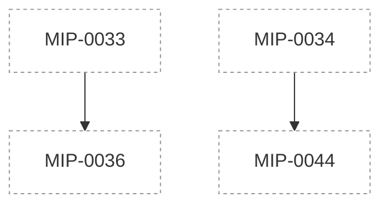

# Marola Improvement Proposals (MIPs)

Design docs for non-trivial changes, written before they're built. The process and template live
in the `mip` skill (`.claude/skills/mip/SKILL.md`); this file is the index. Statuses: Draft →
Accepted → Implemented (or Rejected / Superseded). A MIP built in stages before every task lands
carries `Partially implemented (tasks a–b of N — #PR #PR)`, naming exactly which tasks are done and
what's still missing in its own status row — never a bare "Implemented" until the whole task list
(`MIP-NNNN.tasks.md`, when it exists) is merged.

**Reading the table.** `Effort` and `Gain` are the one-line summary of each MIP's own metadata block
(right after its title table) — read that block for the full reasoning, the `Depends on`/`Risk`
detail, and the exact `Cost so far` sourcing. `Verdict` is the `Effort vs Gain` call from that same
block: `do next` (build it now), `do when X lands` (blocked on a named prerequisite), `cheap win`
(small effort, ships on its own), `expensive, defer` (real value, not worth the cost yet), or `park`
(needs a precondition — usually accumulated data or a later phase — that doesn't exist yet). `Cost
so far` is the summed `Cost:` trailers of a MIP's merged PRs (implementation and, where traceable,
the MIP's own drafting commit); "—" means nothing has merged for it yet, "n/a" means something
merged but carries no usable `Cost:` figure (predates the trailer convention, or the trailer was left
as an unfilled placeholder).

| MIP | Title | Status | Created | Effort | Gain | Verdict | Cost so far |
|---|---|---|---|---|---|---|---|
| [MIP-0001](./MIP-0001-water-quality-and-sea-lore.md) | Bathing-water quality in the ranking, and a sea-lore paragraph in every reply | Implemented | 2026-09-05 | M | user value; exam coverage | cheap win (delivered) | n/a |
| [MIP-0002](./MIP-0002-telegram-bot-phase-1.md) | The Telegram bot — marola's first real user surface | Draft | 2026-09-05 | L | user value | do next | — |
| [MIP-0003](./MIP-0003-fast-replies-caching-and-fan-out.md) | Replies in under three seconds — caching, concurrent fetches, precomputed boards | Draft | 2026-09-05 | M | infra/dev-loop; cost/ops | do next | — |
| [MIP-0004](./MIP-0004-daily-digest-subscriptions-and-reach.md) | The reason to come back — daily digest, subscriptions, and reach beyond Santa Catarina | Draft | 2026-09-05 | L | user value; exam coverage | do when X lands | — |
| [MIP-0005](./MIP-0005-map-and-static-site.md) | The map — every beach's daily recommendation on a static site the pipeline feeds | Implemented | 2026-09-05 | L | user value; cost/ops | cheap win (delivered) | ~$12.46 |
| [MIP-0006](./MIP-0006-live-look-user-cameras.md) | "How does it look right now?" — a live look at each beach, fed by users' cameras | Draft | 2026-09-05 | XL | user value; exam coverage | do when X lands | ~$0.7 (shared w/ MIP-0007) |
| [MIP-0007](./MIP-0007-time-series-foundation-models.md) | Time-series foundation models for marola's own series — local open models first, Azure opt-in | Draft | 2026-09-05 | L | infra/dev-loop; exam coverage | park | ~$0.7 (shared w/ MIP-0006) |
| [MIP-0008](./MIP-0008-docker-images-and-smoke-test.md) | Docker images — lightweight JVM, native (GraalVM), marola-ollama, a fine-tuned variant — built in CI, with a smoke test the map shows | Implemented | 2026-09-05 | XL | infra/dev-loop; cost/ops | cheap win (delivered) | ~$15.98 |
| [MIP-0009](./MIP-0009-map-wave-markers-and-hover-aspects.md) | A richer map — a wave marker per beach and, on hover, every aspect at that point (wind with an emoji, whales, jellyfish, water temperature) | Implemented (tasks: `MIP-0009.tasks.md`, 4 PRs #144-#147) | 2026-09-05 | S | user value; exam coverage | cheap win (delivered) | ~$3.18 (shared bucket) |
| [MIP-0010](./MIP-0010-mlflow-experiment-tracking.md) | MLflow as marola's experiment ledger — benchmark runs, prompt compiles and LLM traces, local server first, Azure ML as the opt-in | Implemented (v1, local only) | 2026-09-05 | L | infra/dev-loop; exam coverage | cheap win (delivered) | ~$16.52 |
| [MIP-0011](./MIP-0011-claude-code-best-practices.md) | Claude Code best practices in this repository — hooks as gates, a shared permission allowlist, path-scoped rules, subagents and skills | Implemented, ultrareview-verified 2026-09-06 | 2026-09-05 | M | infra/dev-loop; cost/ops | cheap win (delivered) | ~$12.86 |
| [MIP-0012](./MIP-0012-llm4s-adoption-and-dspy-deprecation.md) | llm4s as marola's Scala-native LLM/agent layer (opt-in module behind marola's traits) — and the deprecation of the Python DSPy step for a Scala prompt compiler | Draft | 2026-09-05 | XL | infra/dev-loop; exam coverage | do when X lands | n/a |
| [MIP-0013](./MIP-0013-opencode-tryout.md) | OpenCode as marola's development agent — a bounded tryout, and what replacing Claude Code would take | Partially implemented (tasks 1-2 of 6 — PR #197, `MIP-0013.tasks.md`) | 2026-09-05 | S | infra/dev-loop | cheap win | ~289k tok (unpriced) |
| [MIP-0014](./MIP-0014-marola-book.md) | A marola book — *The Compiler Pushes Back*, written in LaTeX, versioned in a repo, built in CI | Draft | 2026-09-05 | XL | community/outreach; exam-prep artifact | expensive, defer | — |
| [MIP-0015](./MIP-0015-interacao-swim-matching.md) | Interação — opt-in "who else is swimming here" matching between marola users | Draft | 2026-09-05 | L | user value; exam coverage | park | — |
| [MIP-0016](./MIP-0016-water-quality-map-markers.md) | Water-quality points on the map — OK / not-OK marks, placed in the sea off the OSM coastline, not on the land where the agency and OSM centres put them | Draft | 2026-09-06 | M | user value; exam coverage | do next | — |
| [MIP-0017](./MIP-0017-agentic-tooling-survey.md) | Agentic tooling ideas from `ai-job-search` and September 2026's trending agent repos | Draft | 2026-09-06 | S | infra/dev-loop | cheap win (§5.1/§5.2); §5.3 no urgency | — |
| [MIP-0018](./MIP-0018-self-documentation-and-media-exporter.md) | Marola self-documentation — weekly post-planner and multi-platform exporter (LinkedIn, blog repo, Substack, Reddit) | Draft | 2026-09-06 | M | infra/dev-loop | cheap win | — |
| [MIP-0019](./MIP-0019-arxiv-ocean-forecasting-survey.md) | arXiv/trending-repo survey — sea-forecasting and jellyfish-prediction techniques for marola | Draft | 2026-09-06 | S/M/L (per §5 item) | user value; exam coverage | cheap win (§5.1); do when X lands (§5.2); park (§5.3) | — |
| [MIP-0020](./MIP-0020-instagram-bot-account.md) | An Instagram account for marola — first post by hand, then API publishing (Instagram Login: professional account, JPEG at a public URL, no Facebook Page, no App Review for an owned account), then a daily pipeline rendered from the board and gated by a GitHub Environment approval (absorbed the former MIP-0024 draft) | Draft | 2026-09-06 | M | community/outreach; infra/dev-loop | cheap win (v1: post by hand) / do when MIP-0018 lands (API path) | — |
| [MIP-0021](./MIP-0021-beach-accessibility.md) | Beach accessibility — parking, toilets, showers and lifeguard posts from OSM, shown only where the data exists ("no data", never "none") | Implemented — merged via PR #202 | 2026-09-06 | S | user value; exam coverage | cheap win (delivered) | — |
| [MIP-0022](./MIP-0022-safety-answer-footer.md) | The safety footer — every answer grounded in a `knowledge/safety/` document ends with lifeguard/193/SAMU 192, appended after the model, never by it | Implemented — merged via PR #195 | 2026-09-06 | S | user value; exam coverage | cheap win (delivered) | ~$73.38 |
| [MIP-0023](./MIP-0023-waitlist-promotion-and-maintenance.md) | Product expansion — a wait-list, honest promotion, and the easiest way to keep marola's site and backend maintained | Draft | 2026-09-06 | S/M/L (per §5 item) | user value; infra/dev-loop; cost/ops | cheap win (§5.1/§5.3); do when X lands (§5.2) | — |
| [MIP-0024](./MIP-0024-instagram-daily-pipeline.md) | The daily Instagram pipeline — automated, per-day content on top of MIP-0020's account | Draft | 2026-09-06 | S (on top of MIP-0020) | user value; cost/ops | do when X lands | — |
| [MIP-0025](./MIP-0025-marola-sea-domain-model.md) | marola-sea-1.0 — a small domain-tuned model (QLoRA SFT + tool-call SFT + DPO) served through Ollama | Partially implemented (task 1 of 6 — PR #192, `MIP-0025.tasks.md`) | 2026-09-06 | M | user value; exam coverage (AI-103 fine-tuning row) | do next (task 1); do when X lands (tasks 2-6) | — |
| [MIP-0029](./MIP-0029-ocean-layer-positioning.md) | Positioning — marola as the ocean intelligence layer; "best hour to swim" as its first use case | Implemented — merged via PR #179 | 2026-09-06 | S | user value; community/outreach | cheap win (delivered) | — |
| [MIP-0030](./MIP-0030-coastal-trails.md) | Coastal and lakeside trails on the map — named OSM paths within 500m of a beach or a lake, via Overpass (not IMA/SC's per-region pattern) | Accepted — implemented, pending merge on `mip-0030/1-coastal-trails` | 2026-09-06 | S | user value; exam coverage | cheap win | — |
| [MIP-0031](./MIP-0031-water-quality-inea-inema.md) | Water quality for Rio (INEA) and Bahia (INEMA) — PDF bulletin parsing plus a curated point-coordinate table, since neither institute publishes a JSON feed or coordinates | Partially implemented (tasks 1-4 of 6 — PRs #200, #203, `MIP-0031.tasks.md`) | 2026-09-06 | M | user value; exam coverage | do next (tasks 5-6: client wiring) | — |
| [MIP-0032](./MIP-0032-model-strategy-benchmark-matrix.md) | The model × strategy benchmark matrix — closed API vs. open local vs. marola-RAG vs. marola-tuned on the same questions, with latency and cost columns; local rows free and gated, paid rows opt-in per run | Draft | 2026-09-06 | M | infra/dev-loop; cost/ops; exam coverage | do next (free half) / do when X lands (paid arm: human go-ahead + key) | — |
| [MIP-0033](./MIP-0033-release-0.md) | Release 0 — the repo goes public, a self-hosted chatbot (Ollama + Cloudflare Tunnel, graceful offline state), the first Hugging Face-published model, and a new Milestones/Releases doc linking MIPs to a named release | Partially implemented (§5.2 of 6 — PR #196, #229) | 2026-09-06 | L | user value; community/outreach; infra/dev-loop | do next (§5.1, §5.3, §5.4) | — |
| [MIP-0034](./MIP-0034-rss-feeds-and-content-syndication.md) | RSS in and RSS out — INMET's live warning feed as an expiring alert banner, a reading queue that feeds `corpus-doc` instead of the index, and marola's own Atom feed on the site | Draft | 2026-09-07 | S/M/L (per §5 item) | user value; infra/dev-loop; exam coverage | cheap win (§5.6 outbound, §5.3 reading queue); do next (§5.2 INMET alerts); park (§5.5 transcripts, §5.7b); reject (auto-ingest into `knowledge/`) | — |
| [MIP-0035](./MIP-0035-map-plugin-api.md) | A plugin API for marola's map — a `windy-plugin-template`-style third-party JS layer, loaded client-side via a committed `plugins.json` manifest; confirmed it needs no move off GitHub Pages. Scoped as a Release 1 item, after MIP-0033's Release 0 | Accepted — implemented, pending merge on `mip-0035/1-plugin-api` | 2026-09-07 | M | user value; community/outreach; infra/dev-loop | do next (after Release 0) | — |
| [MIP-0036](./MIP-0036-marola-advertising-action.md) | Marola Advertising Action (MAA) — the Release 0 launch, channel by channel (LinkedIn personal + org Page, Reddit, YouTube, Instagram via MIP-0020, Medium, Substack), staggered over eight days, and how to sustain it after (handed to MIP-0018) | Draft | 2026-09-07 | M | community/outreach; infra/dev-loop | do when MIP-0033 lands | — |
| [MIP-0037](./MIP-0037-map-pwa.md) | A PWA for marola's map — a service worker caches the app shell and the last board so a flaky-signal beach visit stays usable, offline shown honestly, not hidden (ROADMAP.md §7 K8) | Draft | 2026-09-07 | S | user value; infra/dev-loop | cheap win | — |
| [MIP-0038](./MIP-0038-forecast-model-spread.md) | Model spread — when the wave models disagree, marola says so instead of picking one: `models=` on the marine call it already makes, a deterministic agreed/mixed/split word, the score untouched | Draft | 2026-09-07 | M | user value; exam coverage | do next | — |
| [MIP-0039](./MIP-0039-deterministic-fact-guard.md) | The fact guard — a deterministic check that the model's sentence only says what the numbers say, applied after the model like MIP-0022's footer, never by it | Draft | 2026-09-07 | M | user value; exam coverage | do next | — |
| [MIP-0040](./MIP-0040-validating-the-reviewer-judge.md) | The reviewer has never been validated — pin its decoding, measure it with Cohen's kappa against human labels, then make it a jury of small local models from disjoint families | Draft | 2026-09-07 | M | infra/dev-loop; exam coverage | do next (§5.1 fix + measurement) / do when X lands (the jury) | — |
| [MIP-0041](./MIP-0041-soft-book-ingestion.md) | Soft book ingestion — a maintainer dev-tool distilling short, page-cited candidate principles from a book (first run: Weinberg's *The Psychology of Computer Programming*), classified knowledge vs. agentic-behavior, never auto-applied to AGENTS.md/rule files | Draft | 2026-09-07 | M | infra/dev-loop; exam coverage (AI-103 §5) | cheap win | — |
| [MIP-0042](./MIP-0042-map-v2-live-not-static.md) | `marola.dev/v2` — a map that computes live in the visitor's browser (Open-Meteo is CORS-open; Overpass and the water-quality bulletins are not, so beaches and water stay precomputed), with today's static map frozen at `/v1/` and kept as v2's fallback | Draft | 2026-09-07 | L — a Scala.js cross-build of the scorer (this repo's first JS build target), a second client tree, and a `site.yml` that publishes both; re-rated from M once §4.4 established the scorer cannot be hand-ported to JavaScript without duplicating safety-relevant logic | user value; infra/dev-loop; cost/ops | do next (§5.1's v1 freeze) / do when the Scala.js cross-build proves out (§5.3–§5.4) | — |
| [MIP-0043](./MIP-0043-awesome-agentic-engineering-list.md) | `docs/AWESOME-AGENTIC-ENGINEERING.md` — a curated awesome-list of agentic-engineering tooling plus a human-gated candidate digest script, and a verified "top 10 repos similar to marola" section | Implemented — merged via PR #222 | 2026-09-07 | S | community/outreach; infra/dev-loop | cheap win (delivered) | — |
| [MIP-0044](./MIP-0044-site-sections.md) | marola.dev becomes a site, not just a map — news, a markdown dev blog, generated Scala/Python API docs, a feeds page, about/contact, and a restrained support page | Draft | 2026-09-07 | XL — a page generator, a nav, a markdown pipeline, two documentation toolchains and a new CI workflow, editing five load-bearing pieces of the existing site machinery at once | user value; community/outreach; infra/dev-loop | do next (§5.1–§5.3); do when MIP-0034 lands (§5.4 feeds page); do when MIP-0033 §5.1 lands (§5.5 docs mirror); cheap win (§5.6 Scaladoc) / expensive, defer (§5.6 Python docs) | — |
| [MIP-0045](./MIP-0045-nlp-and-parsing-over-llm.md) | Classic NLP and parsing where an LLM call is currently paying for it — a survey of marola's product pipeline and its own dev loop | Draft | 2026-09-07 | M — one new `KnowledgeStore` in `core` (no new dependency), one benchmark arm, one script change; re-rated from S after §4's probe | cost/ops; infra/dev-loop; exam coverage (AI-103 §5 "Text analysis / entity extraction") | cheap win (§5.1, §5.2); do next (§5.4); park (§5.3) | — |
| [MIP-0046](./MIP-0046-remove-ai-slop-ui.md) | The map without the generated look — a chart-derived icon set replacing every emoji on the page | Draft | 2026-09-07 | M — three site files plus `scripts/site_check.js`, whose emoji assertions are a `just quality-other` gate and have to move in lockstep; "done" needs a browser at 390/1280 px, not only the stub harness | user value; infra/dev-loop | do next — self-contained, and it wants to land before MIP-0042 freezes today's client at `/v1/` | — |
| [MIP-0047](./MIP-0047-desmos-equation-art.md) | Equation-drawn art — Desmos as the sketchpad, the equation as the source, static SVG as the only thing shipped (five sea motifs; no third-party script, no Desmos-exported file, no build step) | Draft | 2026-09-07 | S — one stdlib Python generator with a `--self-test`, one equations file, a generated `<symbol>` block in MIP-0046's sprite; the authoring is hours of human eye-work but not build effort | user value; infra/dev-loop | do when MIP-0046 lands | — |
<!-- mip-graph:start -->

_39 MIP(s) with no declared Blocked-by relationship, not graphed: MIP-0001, MIP-0002, MIP-0003, MIP-0004, MIP-0005, MIP-0006, MIP-0007, MIP-0008, MIP-0009, MIP-0010, MIP-0011, MIP-0012, MIP-0013, MIP-0014, MIP-0015, MIP-0016, MIP-0017, MIP-0018, MIP-0019, MIP-0020, MIP-0021, MIP-0022, MIP-0023, MIP-0025, MIP-0029, MIP-0030, MIP-0031, MIP-0032, MIP-0035, MIP-0037, MIP-0038, MIP-0039, MIP-0040, MIP-0041, MIP-0042, MIP-0043, MIP-0045, MIP-0046, MIP-0047._
<!-- mip-graph:end -->
